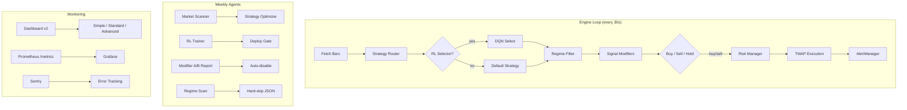

# Algo Trader

A fully automated algorithmic trading system for crypto and US equities, powered by [Alpaca](https://alpaca.markets/) with AI-enhanced signal processing.

The bot runs **9 technical strategies**, selects the best one per symbol using daily backtesting, and enriches signals with **FinBERT sentiment analysis**, a **4-stage Claude LLM analyst pipeline**, and an optional **RL strategy selector (DQN)**. Ten autonomous agents handle optimization, scanning, analysis, feedback scoring, pattern discovery, and health checks on a daily schedule. A self-improving feedback loop scores prediction accuracy and injects learnings back into the LLM prompts.

**Current state:** 1914 tests, ~95% coverage, 17 active symbols (2 crypto + 15 equities), paper trading. Docker-ready with automated startup and scheduling. Sprints 0-7 complete — capital-tier profiles, modifier A/B framework, regime detector, OOS backtest harness, progressive-disclosure dashboard, structured logging + Prometheus/Sentry hooks.



---

## Table of Contents

- [Architecture](#architecture)
- [High-Level Design](#high-level-design)
  - [Core Trading Loop](#core-trading-loop)
  - [Signal Flow Pipeline](#signal-flow-pipeline)
  - [LLM Analyst v2 Pipeline](#llm-analyst-v2-pipeline)
  - [Self-Improving Feedback Loop](#self-improving-feedback-loop)
  - [Risk Management Stack](#risk-management-stack)
  - [Influencer Impact Tracking](#influencer-impact-tracking)
- [Strategies](#strategies)
- [AI Signal Modifiers](#ai-signal-modifiers)
- [Autonomous Agents](#autonomous-agents)
- [Production Hardening (v3)](#production-hardening-v3)
- [Getting Started](#getting-started)
- [Docker Deployment](#docker-deployment)
- [Configuration](#configuration)
- [Usage](#usage)
- [Testing](#testing)
- [Project Structure](#project-structure)
- [Graceful Degradation](#graceful-degradation)

---

## Architecture

```
                              ┌──────────────────────────┐
                              │     STARTUP (5:58 AM)    │
                              │                          │
                              │  Mac wakes → Docker up   │
                              │  → Pre-market agents     │
                              │    (parallel, ~2-3 min)  │
                              │  → Engine starts         │
                              └────────────┬─────────────┘
                                           ▼

┌──────────────────────── SCHEDULED AGENTS (Pre/Post Market) ─────────────────────────┐
│                                                                                      │
│  5:30 AM         5:45 AM          6:00 AM         6:15 AM          5:00 PM   Sunday  │
│  ┌──────────┐   ┌───────────┐   ┌───────────┐   ┌───────────┐   ┌────────┐  ┌─────┐ │
│  │ Strategy │──▶│ Sentiment │──▶│  Market   │──▶│   LLM     │   │ Trade  │  │Patt.│ │
│  │Optimizer │   │  Agent    │   │  Scanner  │   │ Analyst   │   │Analyzer│  │Disc.│ │
│  └────┬─────┘   └────┬──────┘   └────┬──────┘   └────┬──────┘   └───┬────┘  └──┬──┘ │
│       ▼              ▼              ▼              ▼              ▼           ▼     │
│  assignments.json  scores.json   .env update   convictions.json  reports/  patterns │
│                                  fallback_cfg  macro_report.json             .json  │
│                                                sector_report.json                   │
│       ┌──────────────────────────────────────────────────────┐                      │
│       │         5:00 PM: Conviction Scorer                    │                      │
│       │  Score yesterday's predictions vs actual prices       │                      │
│       │  → feedback/ → feedback_summary → inject into prompts │                      │
│       └──────────────────────────────────────────────────────┘                      │
└──────────────────────────────────────────────────────────────────────────────────────┘

                          ▼ agents write JSON ▼ engine reads JSON

┌──────────────────────────── LIVE TRADING ENGINE (24/7) ─────────────────────────────┐
│                                                                                      │
│  ┌────────────────────────────────────────────────────────────────────────────────┐  │
│  │                    run_cycle() — every 60 seconds                              │  │
│  │                                                                                │  │
│  │  ┌───────────────┐  ┌─────────────┐  ┌───────────────────────────────────────┐│  │
│  │  │ Periodic Tasks │  │ Risk Gate   │  │ Per-Symbol Processing                ││  │
│  │  │               │  │             │  │                                       ││  │
│  │  │ Poll orders   │  │ Drawdown    │  │ 1. Check cooldown                    ││  │
│  │  │ Cancel stale  │  │ Halt check  │  │ 2. Fetch bars (or use prefetch)      ││  │
│  │  │ Equity snap   │  │ Exposure    │  │ 3. Check trailing stops              ││  │
│  │  │ Hot reload    │  │ Reconcile   │  │ 4. Route to strategy                 ││  │
│  │  │ Drift detect  │  │             │  │ 5. Compute signal                    ││  │
│  │  │ Exec plans   │  │             │  │ 6. Apply AI modifiers               ││  │
│  │  │ Rebalance    │  │             │  │ 7. Risk + sizing (Kelly/MV)         ││  │
│  │  └───────────────┘  └─────────────┘  │ 8. Txn cost adjustment             ││  │
│  │                                       │ 9. Execute (VWAP/TWAP or direct)   ││  │
│  │                                       └───────────────────────────────────────┘│  │
│  └────────────────────────────────────────────────────────────────────────────────┘  │
│                                                                                      │
│  ┌──────────┐ ┌──────────┐ ┌──────────┐ ┌─────────┐ ┌──────────┐ ┌──────────────┐  │
│  │  Broker  │ │   Risk   │ │  Order   │ │  State  │ │   Data   │ │    Config     │  │
│  │ (Alpaca) │ │ Manager  │ │ Manager  │ │  Store  │ │ Fetcher  │ │   Reloader    │  │
│  └──────────┘ └──────────┘ └──────────┘ └─────────┘ └──────────┘ └──────────────┘  │
│  ┌──────────┐ ┌──────────┐ ┌──────────┐ ┌─────────────────────┐                    │
│  │Execution │ │Portfolio │ │  Txn     │ │  Position           │                    │
│  │  Algo    │ │Optimizer │ │  Costs   │ │  Reconciler         │                    │
│  │(VWAP/TWP)│ │(Kelly/MV)│ │          │ │                     │                    │
│  └──────────┘ └──────────┘ └──────────┘ └─────────────────────┘                    │
└──────────────────────────────────────────────────────────────────────────────────────┘

                          ▼ reads from / writes to ▼

┌──────────────────── PERSISTENCE & MONITORING ────────────────────┐
│  ┌─────────────┐    ┌──────────────┐    ┌─────────────────────┐  │
│  │  trades.db  │◀──▶│  Dashboard   │    │  Drift Detector     │  │
│  │  (SQLite)   │    │ (Flask:5050) │    │  (perf. tracking)   │  │
│  └─────────────┘    └──────────────┘    └─────────────────────┘  │
│  ┌─────────────┐    ┌──────────────┐                             │
│  │Monte Carlo  │    │  Walk-Forward│                             │
│  │ Simulation  │    │  Validation  │                             │
│  └─────────────┘    └──────────────┘                             │
└──────────────────────────────────────────────────────────────────┘
```

---

## High-Level Design

### Core Trading Loop

The trading engine runs a **60-second cycle** for each configured symbol:

1. **Periodic Tasks** — Poll pending orders, tick execution plans, snapshot equity, hot-reload config, drift detection, position reconciliation, portfolio rebalance
2. **Risk Gate** — Check daily drawdown limit, halt status, total exposure cap
3. **Fetch Data** — Pull latest 1-minute OHLCV bars from Alpaca (parallel fetch if enabled)
4. **Check Stops** — Evaluate trailing stops on existing positions (ATR-based or fixed %)
5. **Select Strategy** — RL model picks the best strategy (or fallback to optimizer assignments)
6. **Compute Signal** — Run the selected strategy's technical analysis on the DataFrame
7. **Enrich Signal** — Apply modifiers: sentiment (FinBERT), LLM conviction (Claude), multi-timeframe filter, earnings blackout guard
8. **Risk Check** — Validate exposure limits, cooldowns, drawdown, PDT, correlation, buying power
9. **Size Position** — Kelly criterion or mean-variance optimization, volatility adjustment, transaction cost deduction
10. **Execute** — Submit via VWAP/TWAP algo (large orders) or direct broker order
11. **Log & Persist** — Record trade to SQLite, persist engine state for crash recovery

### Signal Flow Pipeline

```
                 TECHNICAL SIGNAL               AI MODIFIERS                  EXECUTION
                ┌─────────────────┐         ┌───────────────────┐         ┌──────────────┐
                │                 │         │                   │         │              │
 OHLCV Bars ──▶│  Strategy       │────────▶│ 1. Sentiment      │────────▶│  Risk Checks │
 (1-min)       │  (1 of 9)       │ signal  │    (FinBERT)      │ modified│  Correlation │
               │                 │         │ 2. LLM Conviction │ signal  │  Kelly/MV    │
               │  Returns:       │         │    (Claude)       │         │  Vol Sizing  │
               │  action: buy    │         │ 3. RL Selection   │         │  Txn Costs   │
               │  reason: "..."  │         │    (DQN)          │         │  VWAP/TWAP   │
               │  strength: 0.8  │         │ 4. MTF Filter     │         │  or Direct   │
               │                 │         │ 5. Earnings Guard  │         │              │
               └─────────────────┘         └───────────────────┘         └──────────────┘

 Modifier Logic:
 ┌────────────────────────────────────────────────────────────────────────┐
 │  IF signal=BUY and sentiment>0:    strength += sentiment * weight     │
 │  IF signal=BUY and sentiment<-0.5: strength *= 0.7 (dampen 30%)      │
 │  IF signal=SELL and sentiment<0:   strength += |sentiment| * weight   │
 │  Same logic applied for LLM conviction                               │
 │  Final strength clamped to [0.3, 1.0]                                │
 └────────────────────────────────────────────────────────────────────────┘
```

### LLM Analyst v2 Pipeline

The v2 analyst replaces flat per-symbol analysis with a **4-stage top-down pipeline**:

```
 Stage 1: MACRO SCAN (1 Haiku call)
 ┌─────────────────────────────────────────────────────┐
 │ Input: All headlines + influencer mentions           │
 │ + 12 historical macro patterns matched              │
 │ Output: market_bias, risk_level, key_themes         │
 └──────────────────────┬──────────────────────────────┘
                        ▼
 Stage 2: SECTOR ANALYSIS (8 Haiku calls, 1 per active sector)
 ┌─────────────────────────────────────────────────────┐
 │ Input: Macro context + sector headlines             │
 │ + Cross-sector dependencies (Energy<->Industrial)   │
 │ + Influencer context for this sector                │
 │ + Yesterday's accuracy feedback                     │
 │ + Discovered patterns from weekly analysis          │
 │ Output: sector_bias, conviction, drivers            │
 └──────────────────────┬──────────────────────────────┘
                        ▼
 Stage 3: SYMBOL CONVICTION (17 Haiku calls, 1 per symbol)
 ┌─────────────────────────────────────────────────────┐
 │ Input: Macro + sector context + symbol headlines    │
 │ + Technical indicators (RSI, MACD, BB)              │
 │ + Symbol-specific accuracy feedback                 │
 │ + Influencer context for this symbol                │
 │ Output: conviction_score [-1,1], bias, key_factors  │
 └──────────────────────┬──────────────────────────────┘
                        ▼
 Stage 4: PORTFOLIO SYNTHESIS (1 Sonnet call)
 ┌─────────────────────────────────────────────────────┐
 │ Input: All symbol convictions + risk flags          │
 │ Output: portfolio_risk, overall_bias, adjustments   │
 │ + Final adjusted scores per symbol                  │
 └─────────────────────────────────────────────────────┘

 Total: ~27 API calls, ~$0.08/day (mostly Haiku, 1 Sonnet)
```

**Sector Dependencies** encoded in the pipeline:
- Energy <-> Industrial (oil prices affect manufacturing costs)
- Finance -> Tech (rate decisions affect growth valuations)
- Tech -> Consumer (big tech drives consumer spending trends)
- Energy -> Consumer (fuel prices affect consumer sentiment)

**12 Historical Macro Patterns** recognized:
Fed rate hike/cut, oil spike/crash, banking stress, yield curve inversion, USD strength, inflation surprise, employment shock, geopolitical risk, earnings season, China trade tension, tech regulation.

### Self-Improving Feedback Loop

```
 Day N (6:15 AM)                  Day N (5:00 PM)                Day N+1 (6:15 AM)
 ┌───────────────┐               ┌───────────────────┐          ┌───────────────┐
 │ LLM Analyst   │               │ Conviction Scorer │          │ LLM Analyst   │
 │               │               │                   │          │               │
 │ Predictions ──┼──archive──▶   │ Load predictions  │   inject │ Reads feedback│
 │ AAPL: +0.5    │               │ Fetch actual      │────────▶ │ "You predicted│
 │ TSLA: -0.3    │               │ prices via broker │          │  AAPL bullish │
 │ ...           │               │ Score accuracy    │          │  but it fell  │
 └───────────────┘               │ Write feedback    │          │  3%. Adjust." │
                                 └───────────────────┘          └───────────────┘

 Weekly (Sunday 6 PM)
 ┌──────────────────────────┐
 │ Pattern Discoverer       │
 │                          │
 │ Analyzes week's feedback │
 │ "Model overestimates     │
 │  Energy on oil spikes"   │
 │ → Saves patterns.json    │
 │ → Injected into sector   │
 │   prompts next week      │
 └──────────────────────────┘
```

The feedback loop tracks:
- **Direction accuracy** — Did the predicted bias (bullish/bearish/neutral) match the actual price move?
- **Magnitude error** — How far off was the predicted move from the actual?
- **Sector-level accuracy** — Aggregated accuracy per sector (Tech, Energy, Finance, etc.)
- **Rolling 30-day summary** — Injected into prompts to help the LLM calibrate over time

### Risk Management Stack

```
 ┌──────────────────────────────────────────────────────────────┐
 │                 RISK LAYERS (all checked before BUY)         │
 │                                                              │
 │  Layer 1: Daily Drawdown        10% max (halts all trading)  │
 │  Layer 2: Total Exposure Cap    90% of equity                │
 │  Layer 3: Per-Position Size     50% max (* strength)         │
 │  Layer 4: Volatility Sizing     Inverse-vol scaling   [opt]  │
 │  Layer 5: Correlation Check     Block if r > 0.7      [opt]  │
 │  Layer 6: Buying Power Check    Pre-verify funds      [opt]  │
 │  Layer 7: PDT Protection        No same-day sell      [eq]   │
 │                                                              │
 │  On Position:                                                │
 │  - Trailing Stop (2% default, or ATR-based 0.5%-5%)         │
 │  - Updates every cycle (ratchets up, never down)             │
 │                                                              │
 │  Post-Trade:                                                 │
 │  - Cooldown: 900s crypto, 300s equity                        │
 │  - Slippage tracking (if Order Manager enabled)              │
 └──────────────────────────────────────────────────────────────┘
```

### Influencer Impact Tracking

Headlines are matched against **15 key market-moving figures** using case-insensitive keyword matching. When a match is found, historical impact patterns are injected into the LLM prompts.

| Category | Figures |
|----------|---------|
| **Fed/Treasury** | Jerome Powell, Janet Yellen |
| **Tech CEOs** | Elon Musk, Jensen Huang, Tim Cook, Satya Nadella, Mark Zuckerberg, Andy Jassy |
| **Investors** | Warren Buffett, Cathie Wood, Michael Burry, Jamie Dimon |
| **Other** | Michael Saylor, US President, OPEC |

Each figure has mapped sectors, direct symbols, and historical patterns (e.g., "Powell hawkish -> Finance -1.5%, dovish -> Finance +2%").

---

## Strategies

The system ships with **9 technical strategies**, each producing a signal of `{action: buy|sell|hold, strength: 0.3-1.0, reason: string}`:

| # | Strategy | Indicators | Style |
|---|----------|-----------|-------|
| 1 | **Mean Rev Aggressive** | RSI(10) + BB(15, 1.5) | High-frequency mean reversion |
| 2 | **Mean Reversion** | RSI(14) + BB(20, 2) | Classic mean reversion |
| 3 | **Volume Profile** | OBV + MFI + Volume spikes | Volume-driven entries |
| 4 | **Momentum Breakout** | EMA(50) + MACD + breakouts | Trend-following |
| 5 | **MACD Crossover** | MACD/signal line crossovers | Momentum |
| 6 | **Triple EMA Trend** | EMA(8/21/55) + ADX trend filter | Multi-timeframe trend |
| 7 | **RSI Divergence** | Price-RSI divergence detection | Reversal detection |
| 8 | **Scalper** | EMA(5/13) + VWAP + StochRSI | High-frequency scalping |
| 9 | **Ensemble** | Momentum + Mean Reversion vote | Multi-strategy consensus |

The **Strategy Optimizer** agent backtests all 9 strategies against each symbol daily and assigns the best-performing one via a composite score (40% Sharpe + 30% Return + 20% Win Rate + 10% (1-MaxDD)).

---

## AI Signal Modifiers

All AI features are **disabled by default** and controlled via environment variables. When disabled, signals pass through unchanged.

### 1. NLP Sentiment Analysis (FinBERT)

```
Alpaca News API -> Headlines -> FinBERT (local) -> Sentiment Score [-1, +1]
```

- Fetches last 24h of news headlines per symbol via Alpaca's free News API
- Scores each headline using [ProsusAI/finbert](https://huggingface.co/ProsusAI/finbert) (runs locally, no API cost)
- Aggregates into a per-symbol sentiment score written to `data/sentiment/scores.json`
- The signal modifier adjusts strength by `sentiment_score * weight` (default weight: 0.15)
- If sentiment strongly opposes signal direction, strength is dampened by 30%

### 2. LLM Multi-Agent Analyst (Claude)

Two versions available:

**v1 (3-step per-symbol):**
```
For each symbol:
  News Analyst (Haiku) -> Technical Analyst (Haiku) -> Debate Synthesizer (Sonnet)
```

**v2 (4-stage pipeline, recommended):**
```
Macro Scan (Haiku) -> Sector Analysis (Haiku x8) -> Symbol Conviction (Haiku x17) -> Portfolio Synthesis (Sonnet)
```

v2 adds sector dependencies, cross-sector impacts, influencer tracking, prediction feedback, and discovered pattern injection. Cost: ~$0.08/day with daily budget cap (default $1.00).

### 3. RL Strategy Selector (DQN)

```
Market Features (10-dim) -> Trained DQN -> Best Strategy Index (0-8)
```

- State: RSI, Bollinger %B, MACD histogram, Volume ratio, ATR %, momentum, hour encoding, regime proxy
- Reward: rolling Sharpe ratio + switching penalty
- Trains weekly on 90 days of historical data
- Only deployed if validation Sharpe > 0.5

---

## Autonomous Agents

| Agent | Schedule | Purpose | Outputs |
|-------|----------|---------|---------|
| **Earnings Calendar** | Pre-market (startup) | Check earnings blackout windows | `earnings_calendar/output.json` |
| **Sentiment Agent** | Pre-market (startup) | FinBERT sentiment on 24h headlines | `sentiment/scores.json` |
| **Market Scanner** | Pre-market (startup) | Screen & select equities from 80-stock universe | Updates `.env` EQUITY_SYMBOLS |
| **LLM Analyst** | Pre-market (startup) | 4-stage Claude analysis pipeline | `convictions.json`, `macro_report.json` |
| **Trade Analyzer** | 5:03 PM M-F | Daily P&L, per-strategy metrics | `analyzer/reports/<date>.json` |
| **Conviction Scorer** | 5:05 PM M-F | Score prediction accuracy, write feedback | `feedback/<date>.json` |
| **Health Check** | 7:07 PM M-F | Verify all agents ran, data is fresh | `health_report.json` |
| **Strategy Optimizer** | Sun 2:13 AM | Backtest 9 strategies x all symbols | `strategy_assignments.json` |
| **RL Trainer** | Sun 2:43 AM | Retrain DQN strategy selector | `rl_models/dqn_latest.zip` |
| **Pattern Discoverer** | Sun 6:00 PM | Weekly: find systematic biases in predictions | `patterns.json` |

Pre-market agents run **in parallel** on engine container startup (~2-3 min). Post-market and weekly agents run via cron (supercronic in Docker, times in US Eastern, DST-aware). All agents communicate through **JSON files** in the `data/` directory. No agent imports another agent's code.

---

## Production Hardening (v3)

v3 adds production-grade infrastructure, all behind feature flags:

### Order Management & State Persistence
- **Order Manager** — Tracks order lifecycle (PENDING -> SUBMITTED -> FILLED/CANCELED), computes slippage, cancels stale orders
- **State Store** — SQLite persistence of trailing stops, cooldowns, PDT records, halt state. Survives restarts.

### Risk Management Upgrades
- **ATR-based Stops** — Dynamic stop percentage derived from Average True Range (0.5%-5% range)
- **Volatility Sizing** — Inverse-vol position scaling (higher volatility = smaller position)
- **Correlation Check** — Blocks new buys if Pearson correlation > 0.7 with existing positions
- **Freshness Validation** — Skips stale sentiment/LLM data (> 24h old)

### Execution & Performance
- **VWAP/TWAP Execution** — Splits large orders into time-sliced child orders to reduce market impact
- **Transaction Cost Model** — Estimates slippage, spread, and commission before trade; adjusts position size
- **Parallel Data Fetching** — ThreadPoolExecutor for concurrent bar fetching across symbols
- **DB Rotation** — Archives old rows, vacuums database to prevent unbounded growth

### Portfolio Optimization
- **Kelly Criterion Sizing** — Optimal position sizing from win rate and payoff ratio (fractional Kelly, default 0.25)
- **Mean-Variance Optimization** — Markowitz-style allocation maximizing Sharpe ratio with no-short constraints
- **Monte Carlo Simulation** — Bootstrap resampling for VaR, CVaR, and max drawdown distributions (backtest integration)

### Monitoring & Ops
- **Hot Config Reload** — Reloads risk params and feature flags from `.env` without restart
- **Drift Detection** — Compares recent 7 days of trades against baseline, flags degradation
- **Walk-Forward Backtesting** — Rolling-window validation to detect strategy overfitting
- **Position Reconciliation** — Detects drift between engine state and broker positions

### Deployment
- **Docker Compose** — 3-service orchestration (engine + dashboard + agents) with named volumes
- **Automated Startup** — Mac wake → Docker up → pre-market agents (parallel) → engine start
- **Watchdog** — Post-startup verification that all containers are healthy, with a 06:00–13:30 PT time-of-day gate so scheduled shutdowns stick (override: `touch .watchdog_always_on`)
- **Supercronic** — Container-friendly cron for post-market and weekly agent scheduling (US Eastern, DST-aware)

---

## Sprints 5–7 — Democratizing Algo-Trading

Goal: make the v3 engine safe and intelligible for non-expert retail users
($500–$10K accounts) without removing any of the intelligence. Every
feature stays on at full strength; we change defaults, explanations, and
safety rails around it.

### Sprint 5 — Protect the Capital
- **UserProfile system** (`core/user_profile.py`) — Beginner / Hobbyist /
  Learner tiers scale `BASE_POSITION_PCT`, `KELLY_FRACTION`,
  `MAX_DAILY_LOSS_USD`, `MAX_TRADES_PER_DAY`, and `MAX_POSITIONS_OPEN`
  with account size. Auto-detected at startup; downgrade always allowed.
- **AlertManager wired into engine** — rejections, liquidations, broker
  failures, daily DD halt, unauthorized external positions all fire alerts.
- **Pre-trade liquidity gate** — skip trades when spread > 50 bps equity /
  100 bps crypto.
- **Intraday P&L circuit breaker** with dollar floors so a $800 account
  doesn't lose 10% before halting.
- **VaR-aware position cap** — per-trade VaR contribution capped at
  1% (Beginner) / 2% (Hobbyist) / 3% (Learner) of equity.
- **Paper → live promotion gate** in `config.py` — refuses `TRADING_MODE=live`
  without 30+ days of paper history and max drawdown ≥ -3%.

### Sprint 6 — Prove the Edge + Make It Clear
- **Regime detector** (`core/regime_detector.py`) — classifies SPY 20-day
  realized vol into `low_vol / normal / high_vol / crisis`. Mean-rev
  strategies skip crisis; momentum skips low_vol.
- **RL training fix** — 60/20/20 train/val/test split, 100K timesteps,
  transaction costs in reward, warm-start between weekly retrains.
- **RL state space 10→16 dim** — adds vol, vol-of-vol, volume z-score,
  spread z-score, time-to-close, one-hot regime.
- **Modifier A/B framework** (`analytics/modifier_ab.py`) — logs every
  modifier's counterfactual delta per trade; weekly agent auto-disables
  any modifier with ≤ 0 Sharpe contribution over ≥ 5 trades.
- **OOS backtest harness** (`scripts/full_oos_backtest.py`) — 2-year full
  pipeline run (router → modifiers → RL selector), per-regime metrics,
  Monte Carlo trade-order shuffle, acceptance gate at OOS Sharpe ≥ 1.0.
- **Strategy × regime sensitivity matrix** (`analytics/strategy_regime_matrix.py`)
  — empirical hard-skip overrides that augment the hardcoded Sprint 6C
  regime rules.
- **Trade explainer** (`core/trade_explainer.py`) — plain-English one-liner
  per trade ("Bought $15 of AAPL because the price dropped 2% below its
  20-day average") stored alongside the raw signal reason.
- **Dashboard v2** — Simple / Standard / Advanced views, protection-status
  badge, regime tag, Monte Carlo framing box, notification center on the
  Advanced tab.
- **Honest expected-return framing** (`core/expected_returns.py`) — every
  Sharpe / return number is wrapped with industry anchors so "Val Sharpe 2.65"
  never appears naked.

### Sprint 7 — Accessibility + Production-Grade
- **CI gate** (`.github/workflows/ci.yml`) — ruff + pytest + 80% coverage
  required on every PR.
- **Structured JSON logging** (`utils/structured_log.py`) — structlog with
  per-cycle trace IDs. Opt-in via `STRUCTURED_LOG=true`.
- **Prometheus metrics** (`monitoring/metrics.py`) — `/metrics` endpoint
  with equity/cash/trades/cycle duration. Opt-in via `METRICS_ENABLED=true`.
  Stub objects when disabled = zero overhead.
- **Sentry error tracking** (`monitoring/sentry.py`) — gated by `SENTRY_DSN`.
- **Property-based tests** (`tests/test_risk_properties.py`) — hypothesis
  strategies for trailing stop monotonicity, ATR non-negativity, vol
  sizing bounds.
- **Alpaca sandbox integration tests** (`tests/integration/test_alpaca_sandbox.py`)
  — real API calls, skipped by default (`-m integration` to opt in).
- **One-click deploy templates** — `.replit`, `railway.json`, and
  `setup_wizard.py` (interactive CLI) for beginners who can't edit
  dotenv files.
- **Dashboard `/learn`** — 7 beginner mini-lessons explaining strategy,
  RL, regime, trailing stops in plain language.

---

## Getting Started

### Prerequisites

- **Python 3.11+**
- **[Alpaca](https://alpaca.markets/) account** — free paper trading account works (sign up at [alpaca.markets](https://alpaca.markets/))
- **(Optional)** [Anthropic API key](https://console.anthropic.com/) for LLM analyst — buy credits at [console.anthropic.com/settings/billing](https://console.anthropic.com/settings/billing)

### Installation

```bash
# Clone the repository
git clone https://github.com/madhusshivakumar/Algo-Trader.git
cd Algo-Trader

# Create virtual environment
python -m venv .venv
source .venv/bin/activate   # macOS/Linux
# .venv\Scripts\activate    # Windows

# Install dependencies
pip install -r requirements.txt

# Copy environment template
cp .env.example .env
```

### Quick Setup

**Step 1: Get Alpaca API keys**

1. Sign up at [alpaca.markets](https://alpaca.markets/)
2. Navigate to **Paper Trading** > **API Keys**
3. Generate a new API key pair

**Step 2: Configure `.env`**

```bash
# Required — Alpaca credentials
ALPACA_API_KEY=your_paper_key_here
ALPACA_SECRET_KEY=your_paper_secret_here
TRADING_MODE=paper

# Symbols to trade
CRYPTO_SYMBOLS=BTC/USD,ETH/USD
EQUITY_SYMBOLS=TSLA,NVDA,AMD,AAPL,META,SPY
```

**Step 3: Verify setup**

```bash
# Run the test suite
python -m pytest tests/ -x -q

# Check Alpaca connection
python main.py --status
```

**Step 4: Start trading**

```bash
./bot.sh start     # Start the bot (backgrounded)
./bot.sh dash      # Start web dashboard at http://localhost:5050
./bot.sh logs      # Follow live logs
./bot.sh status    # Check bot status + account info
```

---

## Docker Deployment

The recommended way to run the system in production:

```bash
# Build and start all services (engine + dashboard + agents)
./bot.sh docker-up

# Or use the startup script (handles Docker Desktop, retries, health checks)
bash scripts/startup.sh

# Check status
./bot.sh docker-status

# Follow logs
./bot.sh docker-logs engine
./bot.sh docker-logs agents

# Stop everything
./bot.sh docker-down
```

### Architecture (Docker)

| Service | Container | Purpose |
|---------|-----------|---------|
| `engine` | `algo-engine` | Pre-market agents (on startup) → trading engine |
| `dashboard` | `algo-dashboard` | Flask web UI on port 5050 |
| `agents` | `algo-agents` | Post-market + weekly agents via supercronic |

All services share a named volume (`db-data`) for SQLite and bind-mounted `./data` and `./logs` directories.

### Automated Daily Startup

The system is configured to start automatically on weekday mornings:

1. **5:50 AM** — Mac wakes (via `pmset`)
2. **5:58 AM** — `scripts/startup.sh` starts Docker, runs pre-market agents, launches engine
3. **6:45 AM** — Watchdog verifies all containers are running

To set up Mac auto-wake (one-time):
```bash
sudo pmset repeat wakeorpoweron MTWRF 05:50:00
```

### Enabling AI Features

**Sentiment Analysis** (no API key required, runs locally):
```bash
# In .env:
SENTIMENT_ENABLED=true

# Run once manually to populate scores:
./bot.sh sentiment
```

**LLM Analyst** (requires Anthropic API key):
```bash
# In .env:
LLM_ANALYST_ENABLED=true
LLM_ANALYST_V2_ENABLED=true          # Use the 4-stage pipeline
ANTHROPIC_API_KEY=sk-ant-your-key-here

# Optional: enable self-improvement
LLM_FEEDBACK_LOOP_ENABLED=true
LLM_INFLUENCER_TRACKING_ENABLED=true
LLM_PATTERN_DISCOVERY_ENABLED=true

# Run once manually:
./bot.sh llm
```

**RL Strategy Selector** (requires training first):
```bash
# Train the initial model (needs historical data in Alpaca):
./bot.sh rl-train

# Deploy gate is *test* Sharpe (out-of-sample), not val Sharpe.
# Sprint 6B changed this because val Sharpe memorizes the val set — a
# classic pitfall when the same split gates early stopping AND deploy.
# See `core/expected_returns.py` for the reality-anchor framing.
RL_STRATEGY_ENABLED=true
```

### Enabling Production Features (v3)

```bash
# In .env — enable all v3 features:
ORDER_MANAGEMENT_ENABLED=true
STATE_PERSISTENCE_ENABLED=true
ATR_STOPS_ENABLED=true
VOLATILITY_SIZING_ENABLED=true
CORRELATION_CHECK_ENABLED=true
SENTIMENT_FRESHNESS_CHECK=true
PARALLEL_FETCH_ENABLED=true
DB_ROTATION_ENABLED=true
HOT_RELOAD_ENABLED=true
DRIFT_DETECTION_ENABLED=true
POSITION_RECONCILIATION_ENABLED=true
TC_ENABLED=true
VWAP_TWAP_ENABLED=true
EARNINGS_CALENDAR_ENABLED=true

# Portfolio optimization (choose one):
PORTFOLIO_OPTIMIZATION_ENABLED=true
KELLY_SIZING_ENABLED=true         # Kelly criterion sizing
# MEAN_VARIANCE_ENABLED=true      # Or mean-variance (mutually exclusive)

# Monte Carlo (backtest only):
MONTE_CARLO_ENABLED=true
```

---

## Configuration

### Environment Variables (`.env`)

#### Required
| Variable | Description | Example |
|----------|-------------|---------|
| `ALPACA_API_KEY` | Alpaca API key | `PK...` |
| `ALPACA_SECRET_KEY` | Alpaca secret key | `FC...` |
| `TRADING_MODE` | `paper` or `live` | `paper` |

#### Symbols
| Variable | Default | Description |
|----------|---------|-------------|
| `CRYPTO_SYMBOLS` | `BTC/USD,ETH/USD` | Crypto pairs (trade 24/7) |
| `EQUITY_SYMBOLS` | `TSLA,NVDA,AMD,...` | Stocks (market hours only) |

#### Risk Management
| Variable | Default | Description |
|----------|---------|-------------|
| `MAX_POSITION_PCT` | `0.50` | Max single position as % of equity |
| `STOP_LOSS_PCT` | `0.025` | Trailing stop percentage |
| `DAILY_DRAWDOWN_LIMIT` | `0.10` | Halt trading if daily loss exceeds this |
| `ATR_STOP_MULTIPLIER` | `2.0` | ATR multiplier for dynamic stops |
| `CORRELATION_THRESHOLD` | `0.7` | Max Pearson correlation for new positions |

#### AI Features (v2)
| Variable | Default | Description |
|----------|---------|-------------|
| `SENTIMENT_ENABLED` | `false` | Enable FinBERT sentiment analysis |
| `SENTIMENT_WEIGHT` | `0.15` | Sentiment modifier weight |
| `LLM_ANALYST_ENABLED` | `false` | Enable Claude LLM analyst |
| `LLM_ANALYST_V2_ENABLED` | `false` | Use 4-stage pipeline (recommended) |
| `LLM_CONVICTION_WEIGHT` | `0.2` | LLM conviction modifier weight |
| `LLM_QUICK_MODEL` | `claude-haiku-4-5-20251001` | Model for quick analysis calls |
| `LLM_DEEP_MODEL` | `claude-sonnet-4-20250514` | Model for synthesis calls |
| `LLM_BUDGET_DAILY` | `1.00` | Max daily LLM API spend (USD) |
| `ANTHROPIC_API_KEY` | `` | Required for LLM analyst |
| `LLM_FEEDBACK_LOOP_ENABLED` | `false` | Enable prediction scoring feedback |
| `LLM_INFLUENCER_TRACKING_ENABLED` | `false` | Enable influencer headline matching |
| `LLM_PATTERN_DISCOVERY_ENABLED` | `false` | Enable weekly pattern learning |
| `RL_STRATEGY_ENABLED` | `false` | Enable RL strategy selection |

#### Production Hardening (v3)
| Variable | Default | Description |
|----------|---------|-------------|
| `ORDER_MANAGEMENT_ENABLED` | `false` | Order lifecycle tracking + slippage |
| `STATE_PERSISTENCE_ENABLED` | `false` | SQLite state persistence across restarts |
| `ORDER_STALE_TIMEOUT_SECONDS` | `300` | Cancel unfilled orders after this |
| `ATR_STOPS_ENABLED` | `false` | ATR-based dynamic stop sizing |
| `VOLATILITY_SIZING_ENABLED` | `false` | Volatility-adjusted position sizing |
| `CORRELATION_CHECK_ENABLED` | `false` | Block correlated buys |
| `SENTIMENT_FRESHNESS_CHECK` | `false` | Skip stale AI data (>24h) |
| `PARALLEL_FETCH_ENABLED` | `false` | Concurrent bar fetching |
| `FETCH_WORKERS` | `5` | Number of parallel fetch threads |
| `DB_ROTATION_ENABLED` | `false` | Auto-archive old DB rows |
| `DB_ROTATION_MAX_ROWS` | `50000` | Rotate when row count exceeds this |
| `HOT_RELOAD_ENABLED` | `false` | Live config reload without restart |
| `DRIFT_DETECTION_ENABLED` | `false` | Strategy degradation monitoring |
| `DRIFT_LOOKBACK_DAYS` | `7` | Window for drift comparison |
| `VWAP_TWAP_ENABLED` | `false` | VWAP/TWAP order splitting |
| `VWAP_MIN_NOTIONAL` | `5000` | Min order size for algo execution |
| `TC_ENABLED` | `false` | Transaction cost model |
| `POSITION_RECONCILIATION_ENABLED` | `false` | Broker-engine position sync |
| `ALERTING_ENABLED` | `false` | Alert notifications |
| `PORTFOLIO_OPTIMIZATION_ENABLED` | `false` | Portfolio optimizer |
| `KELLY_SIZING_ENABLED` | `false` | Kelly criterion position sizing |
| `KELLY_FRACTION` | `0.25` | Fractional Kelly scaling (0-1) |
| `MEAN_VARIANCE_ENABLED` | `false` | Mean-variance allocation |
| `MONTE_CARLO_ENABLED` | `false` | Monte Carlo simulation (backtest) |
| `EARNINGS_CALENDAR_ENABLED` | `false` | Earnings blackout guard |

---

## Usage

### Bot Commands (`bot.sh`)

```bash
# Local (no Docker)
./bot.sh start       # Start the trading bot (background)
./bot.sh stop        # Stop the trading bot
./bot.sh dash        # Start web dashboard (http://localhost:5050)
./bot.sh dash-stop   # Stop the dashboard
./bot.sh up          # Start bot + dashboard together
./bot.sh down        # Stop everything
./bot.sh status      # Show bot status + account info
./bot.sh logs        # Follow live bot logs
./bot.sh reload      # Hot-reload .env config (SIGHUP)

# Docker (production)
./bot.sh docker-up       # Start all services (engine + dashboard + agents)
./bot.sh docker-down     # Stop all services
./bot.sh docker-status   # Show container status + account info
./bot.sh docker-logs     # Follow engine logs (or: docker-logs agents)
./bot.sh docker-reload   # Hot-reload .env config
./bot.sh docker-backtest # Run backtest in container
./bot.sh docker-test     # Run test suite in container

# Analysis
./bot.sh backtest    # Run strategy backtest
./bot.sh compare     # Compare all 9 strategies (no trading)

# Agents (local)
./bot.sh health      # Run system health check
./bot.sh optimizer   # Run Strategy Optimizer
./bot.sh scanner     # Run Market Scanner
./bot.sh sentiment   # Run Sentiment Agent (FinBERT)
./bot.sh llm         # Run LLM Analyst Agent (Claude)
./bot.sh rl-train    # Run RL Trainer Agent (DQN)
./bot.sh analyzer    # Run Trade Analyzer
./bot.sh earnings    # Run Earnings Calendar Agent
./bot.sh agents      # Run all agents in sequence
./bot.sh test        # Run full test suite
```

### Python CLI

```bash
python main.py              # Run the live/paper trading bot (foreground)
python main.py --backtest   # Run backtester
python main.py --status     # Show account status and recent trades
```

---

## Testing

```bash
# Run full suite (1914 tests)
python -m pytest tests/ -x -q

# Run with coverage report
python -m pytest tests/ --cov --cov-report=term-missing

# Run specific module tests
python -m pytest tests/test_llm_analyst_v2.py -v
python -m pytest tests/test_influencer_registry.py -v
python -m pytest tests/test_conviction_scorer.py -v
python -m pytest tests/test_order_manager.py -v
```

Current: **1914 tests, ~95% line coverage**.

---

## Project Structure

```
algo-trader/
├── agents/                              # 11 autonomous agents
│   ├── earnings_calendar.py             # Pre-market: earnings blackout detection
│   ├── health_check.py                  # System validation (pytest, files, DB, imports)
│   ├── strategy_optimizer.py            # Backtest 9 strategies, assign best per symbol
│   ├── market_scanner.py                # Screen 80 stocks, select 10-20 for trading
│   ├── sentiment_agent.py               # FinBERT news sentiment scoring
│   ├── llm_analyst.py                   # LLM analyst entry point (delegates to v1 or v2)
│   ├── llm_analyst_v2.py               # 4-stage macro->sector->symbol->portfolio pipeline
│   ├── conviction_scorer.py             # Score prediction accuracy, write feedback
│   ├── pattern_discoverer.py            # Weekly pattern learning from feedback
│   ├── rl_trainer.py                    # Weekly DQN model retraining
│   └── trade_analyzer.py               # Daily trade review, learnings, risk adjustments
│
├── core/                                # Trading engine & infrastructure
│   ├── engine.py                        # Main 60s trading loop
│   ├── broker.py                        # Alpaca API (crypto + equities, orders, bars)
│   ├── risk_manager.py                  # Trailing stops, ATR stops, position sizing, drawdown
│   ├── signal_modifiers.py              # Sentiment + LLM + MTF + earnings modifiers
│   ├── order_manager.py                 # Order lifecycle tracking, slippage computation
│   ├── execution_algo.py               # VWAP/TWAP order splitting for large orders
│   ├── portfolio_optimizer.py           # Kelly criterion + mean-variance optimization
│   ├── monte_carlo.py                   # Bootstrap Monte Carlo simulation (VaR, CVaR)
│   ├── transaction_costs.py             # Slippage, spread, commission estimation
│   ├── portfolio_metrics.py             # Sortino, Calmar, expectancy, drawdown analysis
│   ├── position_reconciler.py           # Broker ↔ engine state sync
│   ├── state_store.py                   # SQLite persistence (stops, cooldowns, PDT, orders)
│   ├── data_fetcher.py                  # Parallel bar fetching (ThreadPoolExecutor)
│   ├── config_reloader.py               # Hot-reload .env without restart
│   ├── alerting.py                      # Alert notifications
│   ├── drift_detector.py               # Strategy degradation monitoring
│   ├── walk_forward.py                  # Walk-forward backtesting (overfitting detection)
│   ├── multi_timeframe.py              # Multi-timeframe signal filter
│   ├── influencer_registry.py           # 15 key figures, keyword matching, impact patterns
│   ├── news_client.py                   # Alpaca News API client
│   ├── sentiment_analyzer.py            # FinBERT pipeline wrapper
│   ├── llm_client.py                    # Anthropic SDK (retries, budget tracking, cost)
│   ├── rl_features.py                   # 10-dim feature extraction for RL
│   ├── rl_environment.py                # Gymnasium env for strategy selection
│   └── rl_strategy_selector.py          # DQN inference + fallback
│
├── strategies/                          # 9 trading strategies
│   ├── router.py                        # Dispatches symbol -> strategy + modifiers
│   ├── mean_reversion_aggressive.py     # RSI(10) + BB(15, 1.5)
│   ├── mean_reversion.py               # RSI(14) + BB(20, 2)
│   ├── volume_profile.py               # OBV + MFI + volume spikes
│   ├── momentum.py                      # EMA(50) + MACD + breakouts
│   ├── macd_crossover.py               # MACD/signal crossovers
│   ├── triple_ema.py                    # EMA(8/21/55) + ADX
│   ├── rsi_divergence.py               # Price-RSI divergence
│   ├── scalper.py                       # EMA(5/13) + VWAP + StochRSI
│   └── ensemble.py                      # Momentum + Mean Reversion vote
│
├── utils/
│   ├── logger.py                        # Rich console + SQLite trade logging
│   └── db_rotation.py                   # Database archival and vacuum
│
├── data/                                # Agent communication (JSON files, gitignored)
│   ├── sentiment/scores.json            # FinBERT scores per symbol
│   ├── llm_analyst/                     # LLM analyst outputs
│   │   ├── convictions.json             # Today's conviction scores
│   │   ├── macro_report.json            # Market-level analysis
│   │   ├── sector_report.json           # Per-sector analysis
│   │   ├── spend_log.json               # Daily LLM API spend tracking
│   │   ├── prediction_history/          # Archived daily predictions
│   │   ├── feedback/                    # Accuracy scoring results
│   │   ├── feedback_summary.json        # Rolling 30-day accuracy summary
│   │   └── patterns.json               # Discovered patterns from weekly analysis
│   ├── optimizer/                       # Backtest results & assignments
│   ├── scanner/                         # Selected symbols & candidates
│   ├── analyzer/reports/                # Daily trade reports
│   ├── rl_models/                       # Trained DQN models
│   └── history/                         # Daily archives
│
├── tests/                               # 1914 tests, ~95% coverage
│   ├── conftest.py                      # Shared fixtures
│   └── test_*.py                        # 45 test files
│
├── scripts/                             # Deployment & orchestration
│   ├── startup.sh                       # Reliable startup (Docker check, retries, health)
│   ├── entrypoint.sh                    # Engine container entrypoint (agents → engine)
│   └── run_premarket.sh                 # Parallelized pre-market agent pipeline
│
├── config.py                            # Environment-based configuration (all feature flags)
├── main.py                              # Entry point (bot, backtest, status)
├── dashboard.py                         # Flask web dashboard (:5050)
├── backtest.py                          # Historical backtester (+ Monte Carlo)
├── compare_strategies.py                # Strategy benchmarking tool
├── bot.sh                               # CLI wrapper for all commands (local + Docker)
├── Dockerfile                           # Python 3.11-slim + supercronic
├── docker-compose.yml                   # 3-service orchestration
├── crontab                              # Agent schedule (US Eastern, DST-aware)
├── requirements.txt                     # Python dependencies
├── .env.example                         # Environment template
├── .dockerignore                        # Docker build exclusions
├── .coveragerc                          # Coverage configuration
├── CLAUDE.md                            # Claude Code development guidelines
└── .gitignore                           # Excludes .env, trades.db, data/, logs/
```

---

## Graceful Degradation

The system is designed to **never fail due to a missing AI component**:

| Scenario | Behavior |
|----------|----------|
| FinBERT model not downloaded | Sentiment agent logs error, signals pass through unchanged |
| Alpaca News API unreachable | `fetch_news()` returns empty list, sentiment skipped |
| `ANTHROPIC_API_KEY` not set | LLM agent exits early, convictions file not created |
| LLM daily budget exceeded | Remaining symbols skipped, existing scores still used |
| Claude API returns error | Pipeline uses fallback defaults (neutral, 0 conviction) |
| RL model file missing | Selector returns `None`, router uses STRATEGY_MAP fallback |
| `scores.json` missing/corrupt | `apply_sentiment()` returns signal unchanged |
| `convictions.json` missing/corrupt | `apply_llm_conviction()` returns signal unchanged |
| Feedback files missing | Feedback injection skipped, no error |
| Influencer registry no match | Empty string returned, prompt unchanged |
| State persistence DB error | Engine continues with in-memory state |
| Any feature flag set to `false` | Modifier/subsystem is never called, zero overhead |

---

## Technology Stack

| Component | Technology |
|-----------|------------|
| Language | Python 3.11+ |
| Broker API | Alpaca (`alpaca-py` SDK) |
| LLM API | Anthropic Claude (Haiku + Sonnet) |
| Sentiment Model | ProsusAI/FinBERT (HuggingFace, local) |
| RL Framework | stable-baselines3 (DQN) |
| Database | SQLite (`trades.db`) |
| Dashboard | Flask (port 5050) |
| Console UI | Rich library |
| Testing | pytest (1914 tests) |

---

## Expected Returns (honest version)

Every Sharpe / return number produced by this bot — in logs, in the
dashboard, in this README — is wrapped by `core/expected_returns.py` with
an industry reality anchor. Naked "Val Sharpe 2.65" is never shown alone.

**Industry heuristic for retail algo traders** (post-cost, small account):

| Metric                 | Realistic range          |
|------------------------|--------------------------|
| Sharpe ratio           | 0.5 – 1.5                |
| Annualized return      | -20% to +15%             |
| Backtest-vs-live gap   | Backtest ÷ 2 is optimistic |

If a backtest shows Sharpe 2.65, do NOT expect that live. Most retail
algo traders lose money after costs. The Sprint 6B RL refactor explicitly
separates validation (for early-stopping) from out-of-sample test (for
deploy gating) to reduce this specific form of wishful thinking.

## What This Bot Cannot Do

A conservative list so expectations stay anchored:

- Predict market crashes or black-swan events.
- Guarantee positive returns — in any week, month, or year.
- Replicate hedge-fund-scale edge with retail data feeds.
- Beat buy-and-hold S&P on a small account after transaction costs.
- Trade options, futures, forex, or leveraged instruments.
- Act on inside information, rumors, or social-media sentiment directly.
- Recover from a broker outage faster than a human (we watchdog, we don't guarantee).
- Interpret your personal risk tolerance — you must still size positions you can afford to lose.

If you deploy this with real money, start with the Beginner profile
(≤ $2K) defaults and promote only after 30 days of paper trading history
with max drawdown ≥ -3%. The paper→live gate in `config.py` enforces this;
see Sprint 5G.
| Containers | Docker Compose (3 services) |
| Cron (Docker) | Supercronic (DST-aware) |
| Scheduling | pmset wake + scheduled tasks |

---

## What I'd Do Differently With $1M to Deploy

A candidly honest list of what this system would need to graduate from
hobby to institutional. These are intentionally deferred — they don't
add value at the $500-$10K retail scale this project targets.

1. **Multi-region HA**: Hot-standby in AWS US-East + US-West behind a
   Route53 failover. The engine is stateless enough (state reconstructs
   from broker) that this is an ops problem, not a code problem.
2. **HSM-backed key rotation**: Alpaca keys in AWS Secrets Manager with
   90-day auto-rotation and CloudTrail audit.
3. **Compliance-grade audit log**: MiFID II / FINRA-style transaction
   journal with immutable append-only storage (S3 Object Lock) and
   tamper-proof checksums.
4. **Model registry with rollback**: MLflow tracking server for RL model
   versions; one-click rollback if live Sharpe drops below threshold.
5. **Options-derived signals**: Put/call ratio, IV skew, term structure —
   powerful but requires a paid data subscription Alpaca doesn't provide.
6. **Bayesian hyperparameter optimization**: Auto-tune Kelly fraction,
   ATR multiplier, signal weights via Optuna on rolling OOS windows.
7. **WebSocket order execution**: Ditch REST polling for Alpaca's
   WebSocket stream — sub-second fill confirmations, no polling latency.
8. **Dedicated database**: PostgreSQL (Supabase or RDS) instead of
   SQLite — handles concurrent readers from dashboard + agents without
   WAL lock contention.
